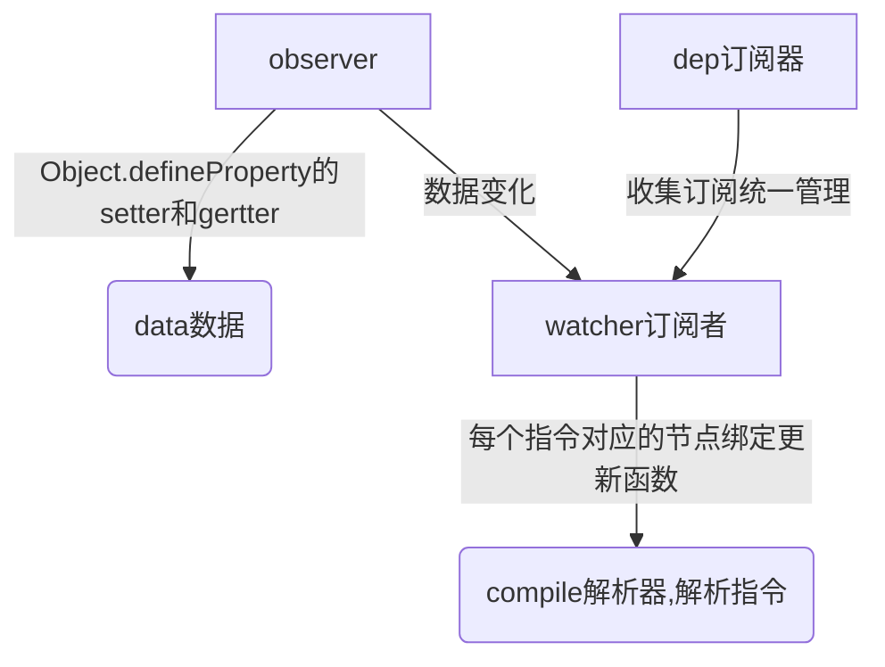

- Vue主要由以下四个步骤实现
    - 实现一个**Observer**：给data对象对数据对象进行遍历，加上getter和setter，实现数据监听
    - 实现一个解析器**Compile**:解析Vue模板指令，将模板的变量替换成数据（data内的变量），还解析v-model v-for等指令进行视图更新，
    - 实现一个订阅者**Watcher**：订阅Observer中属性值变化时，触发Compile中对应的更新函数
    - 实现一个订阅器**Dep**: 发布-订阅 设计模式，收集订阅者

