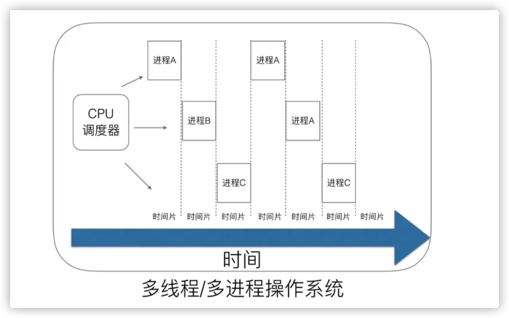

### 多进程概念

每个进程按照最大时间片内执行， 超过时间就切换到下一个进程

### 弊端

### 解决方案

œ

## GMP

### 设计策略

- 复用线程  - 遇到阻塞**创建新**的线程  原来的会**睡眠**或者**销毁**

  - work stealing机制
  - han d off 机制

- 利用并行 - CPU核数/2

- 抢占  -如果有G等待， 最多10ms，就会被抢占 goroutine新策略

- 全局G队列

  