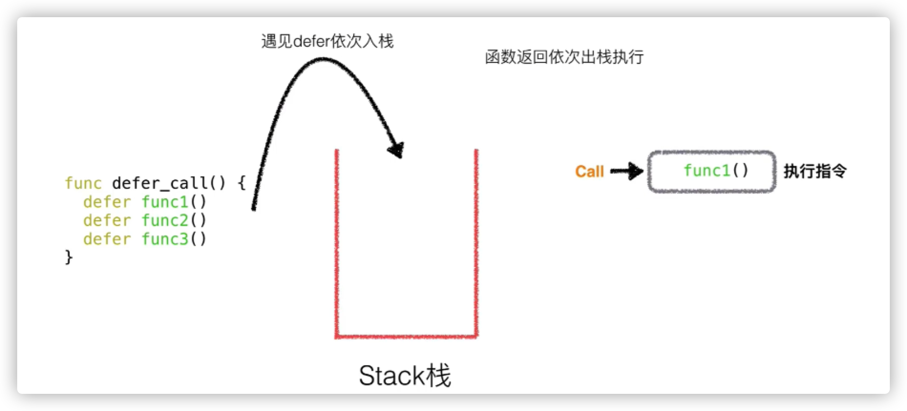

### go-关键字

```go
 default func interface select case defer go struct chan goto  package fallthrough range type var
```

### go-if语句

唯一的不同是不需要小括号，但是大括号还是必须的， 除去不需要写小括号以外，Golang还允许在判断条件之前执行一个简单的语句，并用一个分号`；`隔开。

### go-循环

只有一种循环，**for**循环。判断语句一样，在Golang中也是没有小括号的。

```go
func main() {
	sum := 0
	for i := 0; i < 10; i++ {
		sum += i
	}
	fmt.Println(sum)
}
// 把分号去掉就变成了while循环
func main() {
	sum := 1
	for sum < 1000 {
		sum += sum
	}
	fmt.Println(sum)
}
```

### go-defer

defer 语句会将函数推迟到外层函数返回之后执行。 推迟调用的函数其参数会立即求值，但直到外层函数返回前该函数都不会被调用。

- defer 后面是函数
- 使用： 文件的关闭，或数据库连接的释放等
- 原理： 简单来讲就是将defer语句后面的函数调用的地址压进一个栈中，在当前的函数执行完毕，CPU即将执行函数外的下一行代码之前，先把栈中的指令地址弹出给CPU执行，直到栈为空，才结束这个函数，继续执行后面的代码。


### go-指针

同样是用`&`取地址，用`*`取地址中的值

### go-数组

```go
var a [10]int  //变量 a 声明为拥有 10 个整数的数组。
```

### go-切片

每个数组的大小都是固定的。而切片则为数组元素提供动态大小的、灵活的视角。

```go
a[1:4] //  a 中下标从 1 到 3 的元素
```

### go-make

len（长度）和cap（容量）; len是数组的长度，指的是这个数组在定义的时候，所约定的长度。   cap是数组的容量，指的是底层数组的长度，也可以说是原数组在内存中的长度。

**要指定它的容量，需向 make 传入第三个参数：**

```go
b := make([]int, 0, 5) // len(b)=0, cap(b)=5
```

#### go-队列



