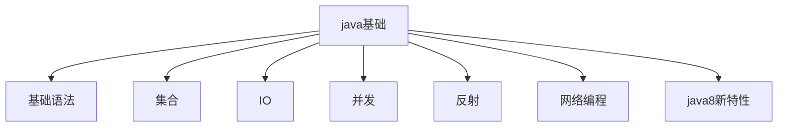
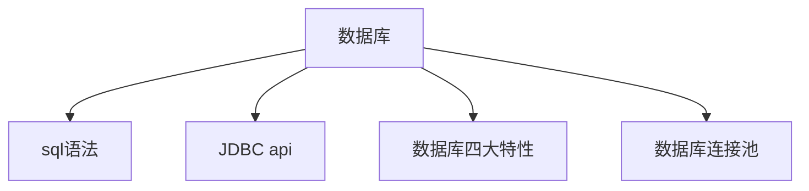
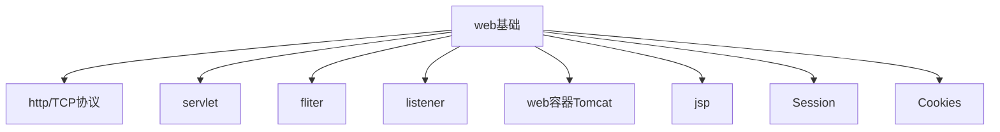
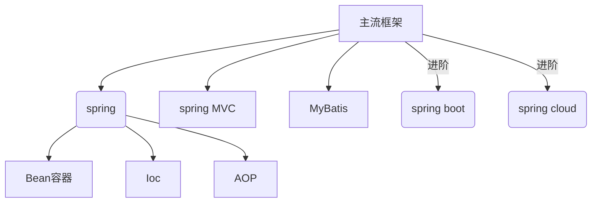

***

# java基础

>流程图

```mermaid

graph TD
java基础 -->A[基础语法]
java基础  -->B[集合]
java基础  -->C[IO]
java基础  -->D[并发]
java基础  -->E[反射]
java基础  -->F[网络编程]
java基础  -->G[java8新特性]

```

```mermaid

graph TD
数据库 -->A[sql语法] 
数据库  -->B[JDBC api]
数据库  -->C[数据库四大特性]
数据库  -->D[数据库连接池]

```

```mermaid

graph TD
web基础 -->A[http/TCP协议]
web基础  -->B[servlet]
web基础  -->C[fliter]
web基础  -->D[listener]
web基础  -->E[web容器Tomcat]
web基础  -->F[jsp]
web基础  -->G[Session]
web基础  -->H[Cookies]

```

```mermaid

graph TD
主流框架 -->A(spring)
A--> c[Bean容器]
  A --> d[Ioc]
   A --> e[AOP]
主流框架  -->B[spring MVC]
主流框架  -->C[MyBatis ]
主流框架  -->|进阶|D(spring boot)
主流框架  -->|进阶|E(spring cloud)

```