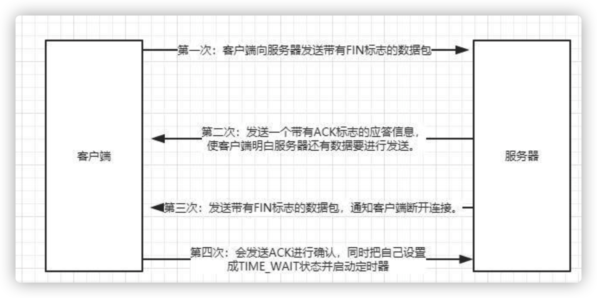

# Host

### 	简介	

​	hosts扩展名的系统文件

### 	作用

​	将网站域名映射到对应的IP

### 	面试题

​	问题：打开网址发生了什么

​	回答

- 1 查找本地hosts - 是否存在网址对应的I P - 是的话就打开对应的网页 - 否2
- 2 ：浏览器查找网址IP - DNS域名解析
  - 浏览器缓存 - 操作系统缓存 - 路由器缓存 - 本地域名服务器缓存 - 跟域名服务器
- 3: 解析网址对应的唯一IP
- 4: TCP连接
  - 三次握手🤝
    - 
- 5: 浏览器HTTP请求
- 6: 服务器处理请求 
- 7: 浏览器渲染页面
  - HTML
  - AJAX异步请求
- 8: 关闭TCP
  - 四次挥手🤝
    - 