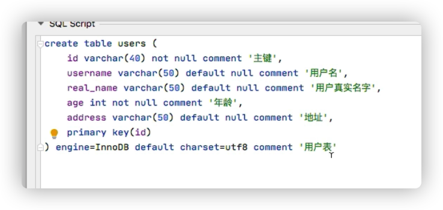

#  node

## npm

换源： npm config get registry  http://registry.npmjs.org

```
npm config set registry https://registry.npm.taobao.org
```

## 开始

- ### node-事件循环机制events - 异步

- ### node- 事件回调 -request -response

- ### node- 流分析 scream

- ### node- 搭建客户端 - client

- ### node- 操纵文件系统及同步 sync 异步 

- ### node- Buffer 整型array[]

- ### node- 错误处理 

- ### node- 异步编程

- ### node- 连接mysql

- ### node- web服务器

### 常用模块

- #### http / url / querystring / util / path / dns / fs / net

### 常用API

- #### request.on('data'/'end')

- #### response.writeHead/end

- #### request.methods

- #### request.headers

- #### request.url

- #### path  __dirname:当前绝对路径

### 常用命令

- ​	读取文件         require(fs)       fs.readFile('xx.text')
- ​    读写文件 
  - 写  const wfs   =  fs.createWriteStream('./t.log')    
    - wfs.write(' ' + Date.now())           
  - 读   const Res =      fs.createReadStream('text', {hightWaterMark: 1024 * 100})
    - Res .on('data')    Res .on('end')    Res .on('error')   
- Fs.unlink      文件删除
- fs.exists.     判断是否存在
- Fs.mkdir            新建 
- fs.rmdirSync       remove：只能删除空文件夹
  - 可以调用r m命令
- fs.chmod     修改权限

#### 案例

- ```
  // 上传视频转码
  const wfs = fs.createWriteStream('./kk.log', {flags: 'a'})
  process.stdin.pipe(wfs)
  process.stdin.resume()
  // 删除 调用rm
  const { spawn } = require('child_process')
  const ls = spawn('rm', ['rf', './dist'])
  ls.stdout.on('data', ()=>{
  })
  ls.stderr.on('data', ()=>{})
  ls.on('close', ()=>{ console.log('exited')})
  ```

### 导入导出

​	exports == module.exports

- ​	exports.name = name 
- ​    module.exports={ name: name }

## npm发包

- 注册npm
- npm publish --access-public
- npm view NAME

## 连接数据库

- #### 建表 - create table Techer(age int(2), name varchar(10), num int(10));

- 