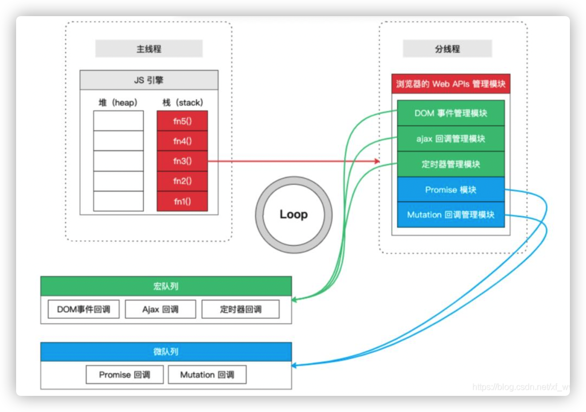

## 浏览器事件循环

### 事件队列

1. 函数：同步和异步
2. 宏队列和微队列

### 宏任务和微任务

微任务的优先级比宏任务的优先级要高

**宏任务**：计时器的回调，ajax，注册的事件，基本上所有的异步操作都是宏任务。

**微任务**：`Promise`回调 和 `MutationObserver`

​			1、await之后的代码属于微任务，相当于promise.then

​			2、process.nextTick和Promise的回调函数，追加在本轮循环，即**同步任务一旦执行完成，就开始执行它们**。

## node事件循环

